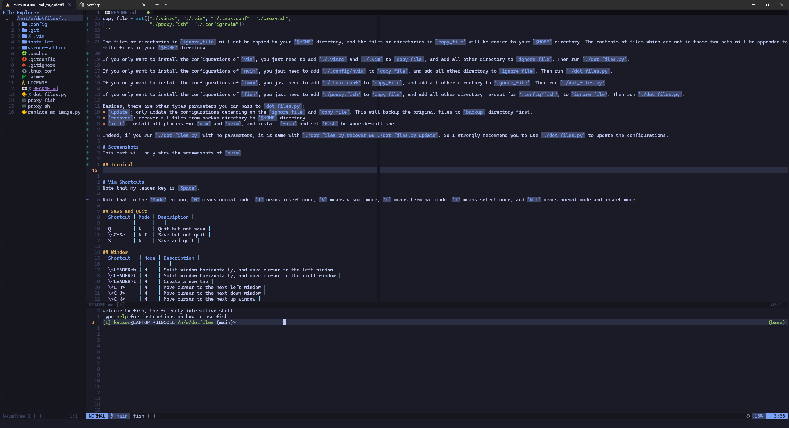
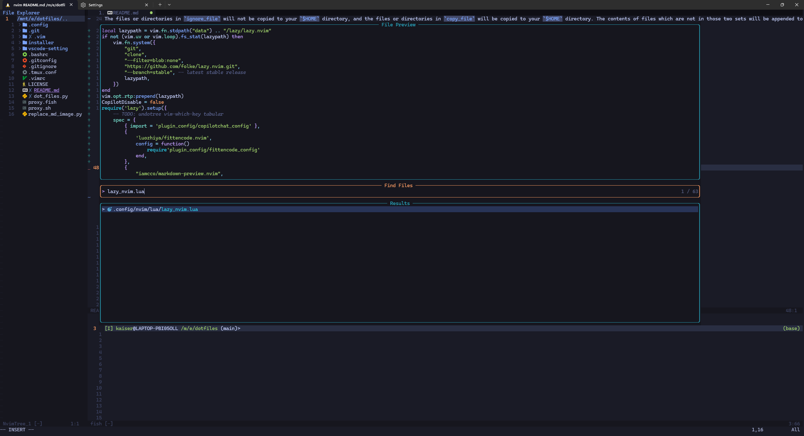
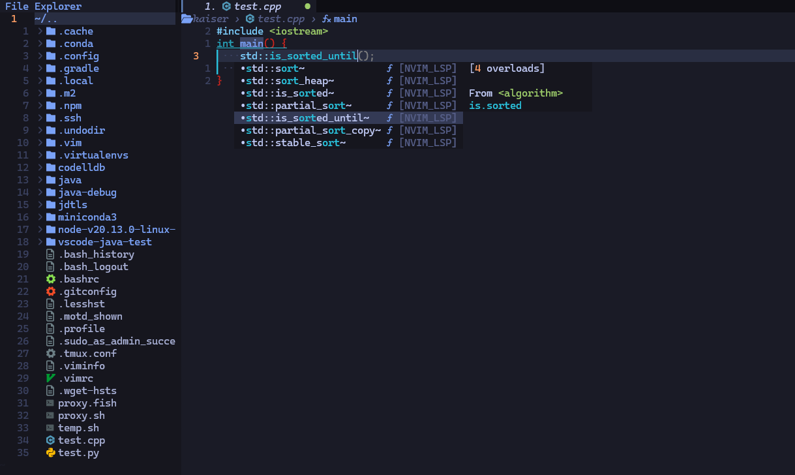
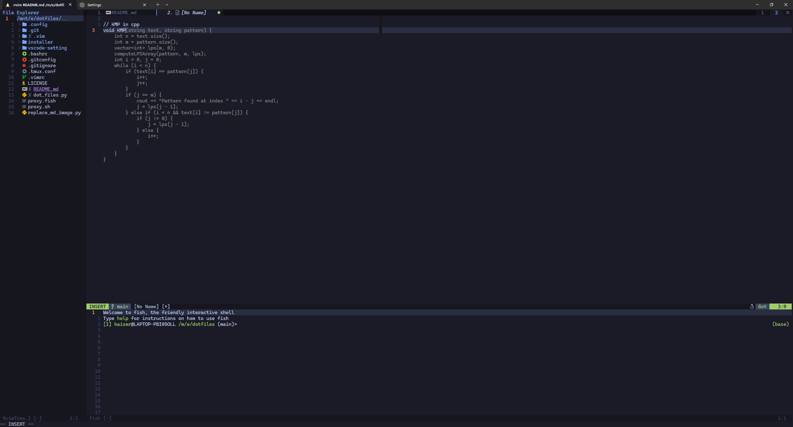
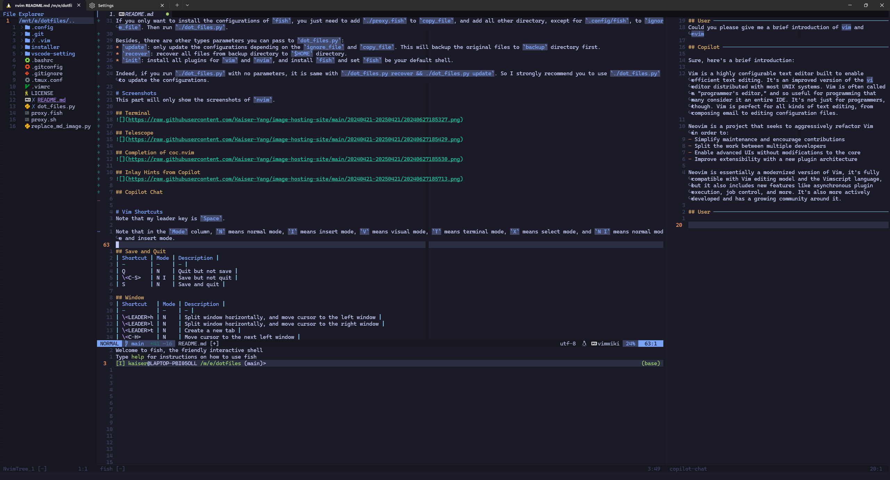
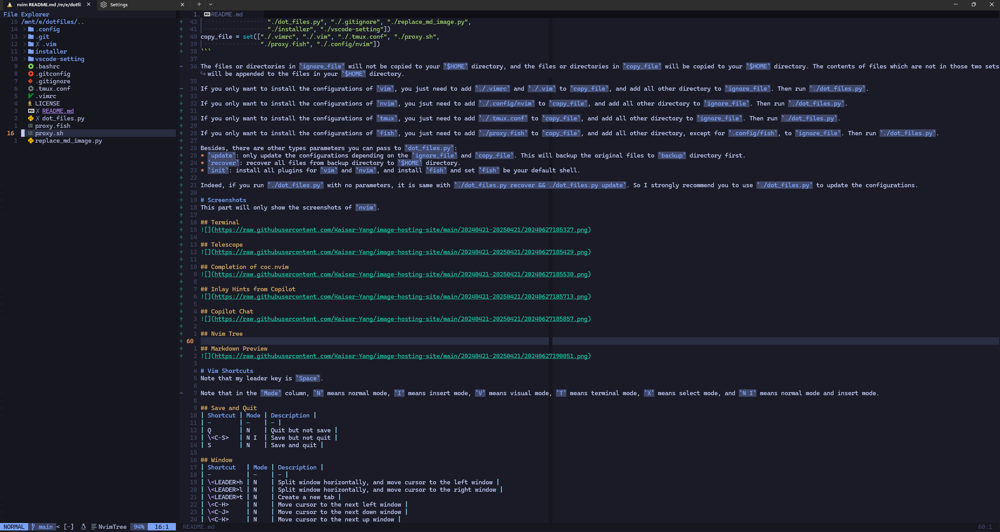
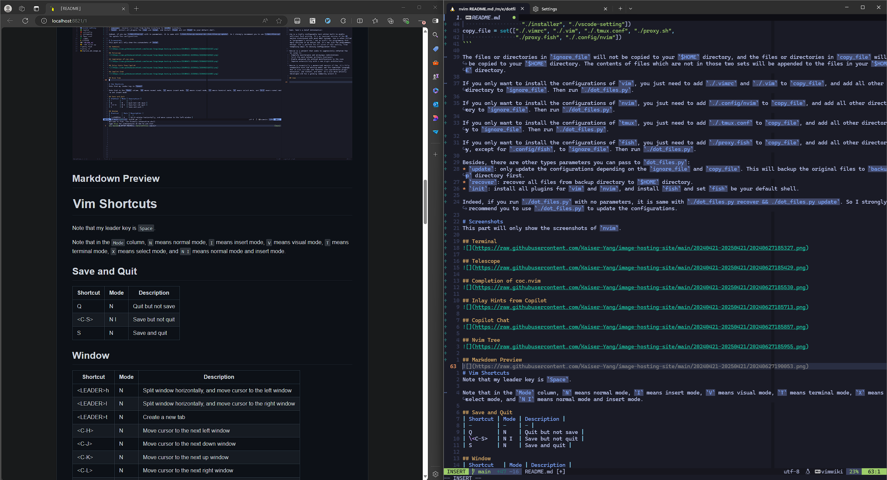
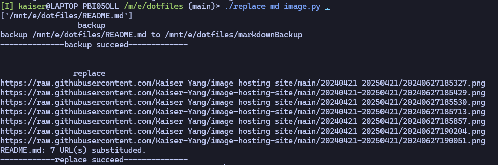

# Table of Contents

<!-- vim-markdown-toc GFM -->

* [dotfiles](#dotfiles)
    * [Some Known Bugs](#some-known-bugs)
        * [Unfixed](#unfixed)
        * [Fixed](#fixed)
    * [Quick Start](#quick-start)
    * [More Information](#more-information)
* [Screenshots](#screenshots)
    * [Terminal](#terminal)
    * [Telescope](#telescope)
    * [Completion of nvim-cmp](#completion-of-nvim-cmp)
    * [Inlay Hints from Copilot](#inlay-hints-from-copilot)
    * [Copilot Chat](#copilot-chat)
    * [Nvim Tree](#nvim-tree)
    * [Markdown Preview](#markdown-preview)
    * [Auto Download and Replace Images in Markdown](#auto-download-and-replace-images-in-markdown)
* [Shortcuts](#shortcuts)
    * [Basic Shortcuts](#basic-shortcuts)
    * [Window](#window)
    * [Copy and Paste](#copy-and-paste)
    * [Cursor Movement](#cursor-movement)
    * [Markdown Helper](#markdown-helper)
    * [Useful Plugins' Shortcuts](#useful-plugins-shortcuts)
        * [Commenting](#commenting)
        * [Surrounding](#surrounding)
        * [Code Related](#code-related)
        * [Git Related](#git-related)
        * [Automatic Completion](#automatic-completion)
        * [Others](#others)
        * [Debugger](#debugger)
* [Contribution](#contribution)

<!-- vim-markdown-toc -->

# dotfiles
My own configure files for UNIX/Linux tools.

## Some Known Bugs
### Unfixed
* When the cursor is at a indent line in insert mode, the cursor is hidden by the indent line.
* `<C-N>` can not back to normal when in replacing mode (after pressing `r`). This seems impossible
to fix, because when press `r<C-N>`, your key sequence is `r<C-N>` (pressing `r` will still waiting
your input, you can see that through the statusline). But `R` is OK, because pressing `R` will let
you enter `REPLACE` mode, you can use `<C-N>` to go back to normal mode.
* When there are more than `3` notifications, the cursor will be flickring. This may have something
to do with the `novim-notify`.
* In `cmd` search, when you remove the last character, the removed character is still visible.
* Quit with `qa` may be slow.

### Fixed
* `auto-pairs` may not be loaded when first use `nvim` to open a file. When opening another file,
`auto-pairs` will be loaded.
* When you use `:q` to quit the terminal, the terminal cannot be opened again. This is because we
will record the terminal's status when you use `Q`, but when you use `:q`, we will not record the
terminal's status. So next time to open the terminal will think the terminal is visible, and hide
it, which will trigger a error. The best way to quit the terminal is to use `Q`.
* When the first time open terminal, it may be wrong highlight. I've disabled the `nvim-treesitter`
for `fish` and `bash` to solve this.
* When there is a `.root` directory, the `nvim-tree` will enter the root directory rather than the
parent directory of `.root`.
* `<CR>` can not auto indent.
* `telescope` can not find files and contents if there is a `.root` directory.
* Pyhton `gd` does not work.
* No hover highlight.
* When quit a help file which is editable, this may cause problem.

## Quick Start
1. Use the command `git clone https://github.com/Kaiser-Yang/dotfiles.git` to clone this repository.
2. Use the command `cd dotfiles` to enter the directory. Run `./dot_files.py init` to install `tmux`
, `fish`, `vim` and `nvim`.
3. Use the command `./dot_files.py` to only copy the configuration files to your `$HOME` directory.
4. You need to install `nodejs` and `yarn` first (If you use `./dot_files.py init` this has been
done).
5. Run `vim` or `nvim` to install plugins. 

NOTE: Before copying the configuration files to your `$HOME` directory, the original files will be
backed up to the `backup` directory in this repository. You can use `./dot_files.py recover` to
recover the original files.

## More Information
In `dot_files.py`, there are two variables:

```python
ignore_file = set(["./.git", "./LICENSE", "./README.md",
                   "./dot_files.py", "./.gitignore", "./replace_md_image.py",
                   "./installer", "./vscode-setting", "./README.assets", "./markdownBackup"])
copy_file = set(["./.tmux.conf", "./proxy.sh", "./proxy.fish", "./.config/nvim"])
```

The files or directories in `ignore_file` will be ignored during installation, and the files or
directories in `copy_file` will be copied to your `$HOME` directory. The contents of files which are
not in those two sets will be appended to the files in your `$HOME` directory.

If you only want to install the configurations of `nvim`, you just need to add `./.config/nvim` to
`copy_file`, and add all other directory to `ignore_file`. Then run `./dot_files.py`.

If you only want to install the configurations of `tmux`, you just need to add `./.tmux.conf` to
`copy_file`, and add all other directory to `ignore_file`. Then run `./dot_files.py`.

If you only want to install the configurations of `fish`, you just need to add `./proxy.fish` to 
`copy_file`, and add all other directory, except for `.config/fish`, to `ignore_file`. Then run
`./dot_files.py`.

Besides, there are other types parameters you can pass to `dot_files.py`:
* `update`: only update the configurations depending on the `ignore_file` and `copy_file`. This will
backup the original files to `backup` directory first.
* `recover`: recover all files from backup directory to `$HOME` directory.
* `init`: install all plugins for `nvim`, `tmux` and install `fish` and set `fish` be your default
shell.

Indeed, if you run `./dot_files.py` with no parameters, it is same with
`./dot_files.py recover && ./dot_files.py update`. So I strongly recommend you to use
`./dot_files.py` to update the configurations.

# Screenshots
This part will only show the screenshots of `nvim`.

## Terminal


## Telescope


## Completion of nvim-cmp


## Inlay Hints from Copilot


## Copilot Chat


## Nvim Tree


## Markdown Preview


## Auto Download and Replace Images in Markdown
There is a file called `replace_md_image.py`, this file receive a directory as a parameter, and it
will download all the images in the markdown files (recursively) in the directory and replace the
image links with the local links. This will backup your markdown files first:



# Shortcuts
Note that my leader key is `Space`.

Note that in the `Mode` column, `N` means normal mode, `I` means insert mode, `V` means visual mode,
`T` means terminal mode, `X` means select mode, and `N I` means normal mode and insert mode.

## Basic Shortcuts
| Shortcut    | Mode      | Description |
| -           | -         | - |
| \<C-T>      | N I T     | Toggle a terminal |
| \<C-S>   | N I  | Save but not quit |
| Q           | N         | Quit a window, quit a tab or unload a buffer, not save |
| S           | N         | Similar with `Q`, but this will execute 'write' first |
| \<C-N>      | T I V X N | Back to normal mode by `<C-\><C-N>` |
| J           | V         | Move selected content down, support `{count}J` |
| K           | V         | Move selected content up, support `{count}K` |
| \<LEADER>r  | N         | Run the current file depends on its filetype, this will onpen a terminal for some filetypes |
| \<LEADER>ay | N         | Copy all lines of current buffer to plus register |

NOTE: The `Q`'s behavior depending on the status. If current buffer is a terminal, `nvimtree`,
`aerial`, or `help`, this will use `bd!` to unload the buffer. If current tab has more than one
window whose buffer is a visible one, `Q` will use `:quit!` to close window, but not unload the
buffer. If there are more than one tab and only one window in current tab, this will close the whole
tab and unload the empty `noname` buffers and other hidden buffers. If there only one tab, this will
unload current buffer.

NOTE: There will only be one terminal globally, this is for some simply commands, such as run a single
`python` file or check the `cpu` usage by `top` or `htop`. If you want something complex, you should
depend on the `tmux` rather than `nvim` terminal. Besides, the terminal will auto open when entering
a new tab if there has been one open terminal or auto close when entering a new tab if the one has
been closed. There only one terminal buffer, so each terminal has same contents.

## Window
| Shortcut   | Mode | Description |
| -          | -    | - |
| \<LEADER>h | N    | Split window horizontally, and move cursor to the left window |
| \<LEADER>l | N    | Split window horizontally, and move cursor to the right window |
| \<LEADER>t | N    | Create a new tab |
| \<C-H>     | N T  | Move the cursor to the left window, this can jump over tmux |
| \<C-J>     | N T  | Move the cursor to the bottom window, this can jump over tmux |
| \<C-K>     | N T  | Move the cursor to the top window, this can jump over tmux |
| \<C-L>     | N T  | Move the cursor to the right window, this can jump over tmux |
| \<LEADER>H | N    | Close the current window, and reopen it at left |
| \<LEADER>J | N    | Close the current window, and reopen it at bottom |
| \<LEADER>K | N    | Close the current window, and reopen it at top |
| \<LEADER>L | N    | Close the current window, and reopen it at right |
| \<LEADER>n | N    | Go to next tab |
| \<LEADER>b | N    | Go to previous tab |
| \<LEADER>1 | N    | Go to the first tab |
| \<LEADER>2 | N    | Go to the second tab |
| ...        | ...  | ... |
| \<LEADER>8 | N    | Go to the eighth tab |
| \<LEADER>9 | N    | Go to the ninth tab |
| Up         | N    | Resize +5 for the current window |
| Down       | N    | Resize -5 for the current window |
| Left       | N    | Resize -5 vertically for current window |
| Right      | N    | Resize +5 vertically for current window |

NOTE: We can not bind `<C-H>` in insert mode, so in the insert mode, when you press `<C-H>`, it will
trigger backspace.

## Copy and Paste
| Shortcut    | Mode | Description |
| -           | -    | - |
| Y           | N    | Copy till end of line to unnamed register |
| \<LEADER>y  | N V  | Copy to system clipboard, this is like `y`, for example, you can use `<leader>yw` to copy a word |
| \<LEADER>ya | N    | Copy all contents in the current buffer to system clipboard |
| \<LEADER>Y  | N    | Copy till end of line to system clipboard |
| \<LEADER>p  | N    | Paste from system clipboard |
| \<LEADER>P  | N    | Paste from system clipboard before cursor |

NOTE: if you want to copy around a bracket, you can use `<LEADER>ya`, too. But you need to  wait
some time when you press `<LEADER>y` (make sure that there is `"+y` at the right bottom), then you
can press `a`.

## Cursor Movement
| Shortcut | Mode | Description |
| -        | -    | - |
| \<C-J>   |      | When there is a selection list and `j` will input letter j, `<C-J>` will move the cursor to the next selection |
| \<C-K>   |      | When there is a selection list and `k` will input letter k, `<C-K>` will move the cursor to the previous selection |
| j        |      | When there is a selection list and you can not input with `j`, `j` will move the cursor to the next selection |
| k        |      | When there is a selection list and you can not input with `k`, `k` will move the cursor to the previous selection |
| \<C-J>   | I    | When there is no selection list, `<C-J>` will move the cursor to the next line |
| \<C-K>   | I    | When there is no selection list, `<C-K>` will move the cursor to the previous line |
| J        | V    | Move the selected lines down |
| K        | V    | Move the selected lines up |

Note that when `cmp` suggestion list is not shown but `copilot` is shown, it is possible to use
`<C-J>` and `<C-K>` to move the cursor to the next or previous selection of `copilot`.

For example when you use `gr` to go to references of a function or a variable, there may be a
selection list (if there is not only one reference), and you can use `j` and `k` to move the cursor
to the next or previous selection. But when you use `<C-P>` to find files, in this case `j` and `k`
will input letter j and letter k, so you can use `<C-J>` and `<C-K>` to move the cursor to the next
or previous selection.

## Markdown Helper
These settings only work in a markdown file.

Some of the settings below will insert `<++>` as a placeholder symbol, and you can use `,f` to move
the cursor out of the current block and remove the placeholder symbol.

| Shortcut | Mode | Description |
| -        | -    | - |
| ,f       | I    | Move the cursor out of the current block and remove next placeholder symbol |
| ,t       | I    | Insert command line block and leave the cursor where you can input the command |
| ,b       | I    | Insert bold line block and leave the cursor where you can input the bold content |
| ,m       | I    | Insert math line block and leave the cursor where you can input the math |
| ,M       | I    | Insert math block and leave the cursor where you can input the math |
| ,c       | I    | Insert code block, and leave the cursor where you should input the code language |
| ,n       | I    | Insert a new line symbol of html |

## Useful Plugins' Shortcuts
This part has a lot of shortcuts, and I'll only list some common ones. All the shortcuts started
with `<LEADER>`, `[` or `]` can be seen in `vimwhichkey` plugin, which means you just need press
`<LEADER>`, `[` or `]` and wait for a while, there will be pop up window to show all the shortcuts
started with the key you press.

### Commenting
| Shortcut                   | Mode | Description |
| -                          | -    | - |
| [count]\<LEADER>c\<LEADER> | N    | Toggle comments (line style) |
| [count]\<LEADER>cs         | N    | Toggle comments (block style) |
| \<LEADER>c[count][motion]  | N    | Toggle comments (line style) with motion |
| \<LEADER>s[count][motion]  | N    | Toggle comments (block style) with motion |
| \<LEADER>c\<LEADER>        | V    | Toggle comments (line style) of the selected line |
| \<LEADER>cs                | V    | Toggle comments (block style) of the selected line |

### Surrounding
| Shortcut              | Mode | Description |
| -                     | -    | - |
| ys\<motion>\<bracket> | N    | Surround something |
| yss\<bracket>         | N    | Surround the whole line with the character you input, this one will put the surrounding in the current line |
| ySS\<bracket>         | N    | Surround the whole line with the character you input, this one will put the surrounding in new lines |
| ds\<bracket>          | N    | Delete the surrounding you input |
| cs\<old>\<new>        | N    | Change the surround with a new one |
| S\<bracket>           | V    | Surround the selected characters |
| \<C-B>                | I    | Back insert a surrounding, when a surrounding does not match, you press the close surrounding, the cursor may jump to the next close surrounding rather than inserting a new close surrounding. In this case, you can use `<C-B>` to back insert a close surrounding |

Some examples of surrounding:
* `ysf;{`: surround the character from the cursor to next `;` with `{}`.
* `yst;{`: surround the character from the cursor till next `;` with `{}`, this will leave the `;`
out of the surrounding.
* `ds(`: delete the `()` surrounding current part.
* `cs([`: change the `()` with `[]` for current surrounded part.

NOTE: the difference between `ysw[` ans `ysw]` is that the former will add white space at left and
right, the latter will not.

### Code Related
<!--| gh         | N    | Go to the header file |-->
<!--| H          | N    | Quick fix |-->
| Shortcut   | Mode | Description |
| -          | -    | - |
| gd         | N    | Go to definition |
| gr         | N    | Go to references |
| \<LEADER>R | N    | Rename the current symbol |
| \<LEADER>r | N    | Run the single file depending on its filetype |
| ]d         | N    | Go to next diagnostic |
| [d         | N    | Go to previous diagnostic |
| \<LEADER>d | N    | Show document symbols, this can also be used to show variables' types |

### Git Related
| Shortcut | Mode | Description |
| -        | -    | - |
| ]g       | N    | Go to next git hunk |
| [g       | N    | Go to previous git hunk |
| ]c       | N    | Go to next git conflict |
| [c       | N    | Go to previous git conflict |
| gcu      | N    | Undo (reset) current git hunk |
| gcd      | N    | Show difference of current git hunk |
| gcc      | N    | When there is a conflict, this will keep current change |
| gci      | N    | When there is a conflict, this will keep incoming change |
| gcb      | N    | When there is a conflict, this will keep both changes |
| gcn      | N    | When there is a conflict, this will keep none change |

### Automatic Completion
| Shortcut | Mode | Description |
| -        | -    | - |
| C-F      | I    | Select one line when `copilot` suggestions are shown |
| \<ESC>f  | I    | Select one word when `copilot` suggestions are shown. In 7-bit terminal press `<M-F>` will trigger `<ESC>f` |
| \<ENTER> | I    | Select current suggestion when one `cmp` suggestion is selected |
| \<ENTER> | I    | Select first suggestion when `cmp` is not shown and `copilot` is shown |
| \<C-C>   | I    | Close all completion when no selection in `cmp`; close `cmp` completion when there is a selection of `cmp`; close copilot completion when `cmp` invisible and copilit visible; back to normal |

### Others
<!--| \<C-Q>     | N I  | Open undo history |-->
<!--| \<LEADER>a | N    | Align a block, `:`, `=` and `\|` are supported, for example, you can use `<LEADER>a=` to align a block of assignments |-->
| Shortcut          | Mode | Description |
| -                 | -    | - |
| \<C-W>            | N I  | Toggle code outline |
| \<C-E>            | N I  | Toggle explorer |
| \<C-P>            | N I  | Find files in the current directory or a git root directory |
| \<C-F>            | N I  | Find contents in the current directory or a git root directory |
| ys{motion}f{name} | N    | Surround the part with a function call |
| dsf               | N    | Delete a function call, only parameters will be left |
| csf{name}         | N    | Change a function call with a new one |
| \<CR>             | N    | In file explorer, this will enter a directory or open a file |
| \<BS>             | N    | In file explorer, this will go to the `..` directory. You can use `?` to see more mappings in file explorer. |
| gy                | N    | List all the yanked contents |
| \<LEADER>ay       | N    | Yank all contents |
| \<ESC>            | I    | When use `telescope` to search, `<ESC>` will let you back to normal mode |
| \<ESC>            | N    | When use `telescope` to search and you are in normal mode, `<ESC>` will quit `telescope` |
| \<C-C>            | I    | When use `telescope` to search and you are in insert mode, `<C-C>` will quit `telescope` |
| gpt               | N    | Toggle `copilot-chat` window |
| gpt               | V    | Input `:CopilotChat`, you can use `<TAB>` to trigger menu list of all commands |
| gb                | N    | Buffer pick |
| \<LEADER>n        | N    | Go to the right buffer shown in `bufline` |
| \<LEADER>b        | N    | Go to the left buffer shown in `bufline` |
| \<C-D>            | I    | Scroll down the completion preview window, if there is one |
| \<C-U>            | I    | Scroll up the completion preview window, if there is one |
| gz                | N    | Toggle Zen Mode |

### Debugger
| Shortcut   | Mode | Description |
| -          | -    | - |
| \<LEADER>D | N    | Toggle the `dap-ui`. |
| \<LEADER>C | N    | Continue. |
| \<LEADER>B | N    | Toggle the break point at current line. |
| \<LEADER>N | N    | Next (step over). |
| \<LEADER>S | N    | Step in. |
| \<LEADER>F | N    | Finish (step out). |
| \<LEADER>T | N    | Terminate current process. |

# Contribution
If you have any suggestion or find any bug, please feel free to open an issue or pull request.
